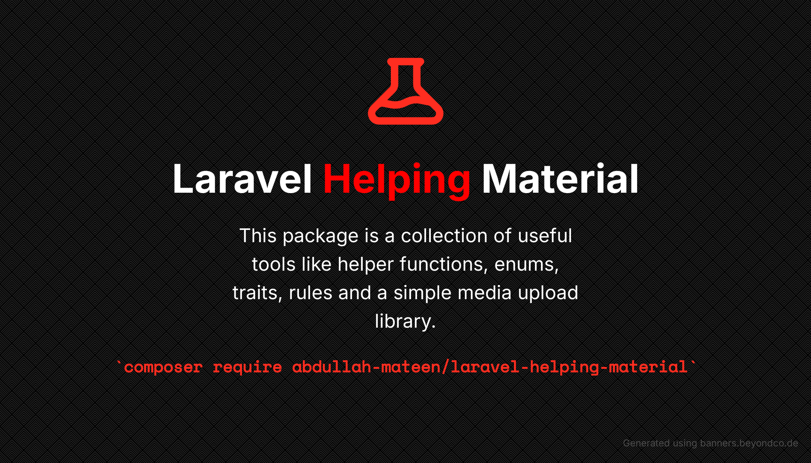

[](./images/banner.png)

<div align="center">

[](https://packagist.org/packages/abdullah-mateen/laravel-helping-material)
[](https://github.com/AbdullahMateen/laravel-helping-material/issues)
[](https://github.com/AbdullahMateen/laravel-helping-material)
[](https://github.com/AbdullahMateen/laravel-helping-material/network)
[](https://github.com/AbdullahMateen/laravel-helping-material/watchers)

</div>

# Laravel Helping Material

Laravel Helping Material is a Laravel utility package that bundles common helpers, enums, model traits, API response helpers, middleware, resources, and a class-based media upload service.

It is designed for Laravel applications that need reusable project scaffolding plus simple media storage flows such as profile images, documents, temporary uploads, and database-backed media records.

## Table Of Contents

- [Features](#features)
- [Requirements](#requirements)
- [Installation](#installation)
- [Configuration](#configuration)
- [Publishing Files](#publishing-files)
- [Artisan Commands](#artisan-commands)
- [Helper Functions](#helper-functions)
- [Upgrade Guide](#upgrade-guide)
- [Enums](#enums)
- [Models](#models)
- [Middleware](#middleware)
- [Blade Directives](#blade-directives)
- [Response Macros](#response-macros)
- [Media Service](#media-service)
- [Interfaces](#interfaces)
- [Resources](#resources)
- [Validation Rules](#validation-rules)
- [Examples](#examples)
- [Author](#author)
- [License](#license)

## Features

- Helper functions for application config, auth, files, dates, numbers, strings, arrays, pagination, XML, and impersonation.
- PHP backed enums for user, media, temporal, notification, boolean, and status values.
- Model base classes and model traits for common Laravel model behavior.
- `authorize` middleware for role-level route authorization.
- API response trait and response macros for consistent JSON responses.
- Blade directives for displaying validation errors.
- Class-based `MediaService` plus typed services: `ImageService`, `AudioService`, `VideoService`, `DocumentService`, and `ArchiveService`.
- Optional publish command for copying config, enums, helpers, middleware, migrations, models, resources, services, and traits into your app.

## Requirements

- PHP `^8.1`.
- Laravel `^10.0`, `^11.0`, `^12.0`, or `^13.0`.
- PHP extensions: `curl`, `fileinfo`, `gd`, `intl`, `json`, and `simplexml`.
- `intervention/image` `^3.3`.

The package is compatible with PHP 8.4 and PHP 8.5, and the test suite has been verified on PHP 8.5.

## Installation

Install the package with Composer:

```sh
composer require abdullah-mateen/laravel-helping-material
```

Laravel package auto-discovery registers the service provider automatically. If package discovery is disabled in your project, register the provider manually:

```php
// config/app.php
'providers' => [
    AbdullahMateen\LaravelHelpingMaterial\LaravelHelpingMaterialServiceProvider::class,
],
```

After installation, publish the storage symlink if you store public files:

```sh
php artisan storage:link
```

## Configuration

Publish the config when you need to customize models, strict mode, storage, or media extensions:

```sh
php artisan vendor:publish --tag=laravel-helping-material-config
```

The config file is published to `config/lhm.php`.

Important config keys:

```php
return [
    'api' => [
        'response_keys' => [
            'snake_case' => env('LHM_SNAKE_CASE', false),
        ],
    ],

    'models' => [
        'should_be_strict' => env('LHM_SHOULD_BE_STRICT', false),
        'user' => App\Models\User::class,
    ],

    'storage' => [
        'folder' => env('STORAGE_FOLDER', 'storage'),
        'shared' => [
            'enabled' => env('SHARED_STORAGE', false),
            'path' => env('SHARED_STORAGE_PATH', null),
        ],
    ],

    'media_service' => [
        'model' => AbdullahMateen\LaravelHelpingMaterial\Models\Media::class,
        'media_disk_enum' => AbdullahMateen\LaravelHelpingMaterial\Enums\Media\MediaDiskEnum::class,
        'extensions' => [
            'image' => ['png', 'jpg', 'jpeg', 'bmp', 'gif', 'svg', 'webp'],
            'audio' => ['mp3', 'aac', 'ogg', 'flac', 'alac', 'wav', 'aiff', 'dsd', 'pcm'],
            'video' => ['mp3', 'mp4', 'mov', 'webm'],
            'document' => ['pdf', 'doc', 'docx', 'csv', 'xlx', 'txt', 'pptx', 'divx'],
            'archive' => ['7z', 's7z', 'apk', 'jar', 'rar', 'tar.gz', 'tgz', 'tarZ', 'tar', 'zip', 'zipx'],
        ],
    ],
];
```

## Publishing Files

The package supports Laravel vendor publishing and its own interactive publish command.

Publish config only:

```sh
php artisan vendor:publish --tag=laravel-helping-material-config
```

Publish migrations only:

```sh
php artisan vendor:publish --tag=laravel-helping-material-migrations
```

Run the interactive package publisher:

```sh
php artisan lhm:publish
```

`lhm:publish` shows a menu and lets you publish one or more groups.

| Option | What it publishes | Destination |
| --- | --- | --- |
| `All` | Every supported publish group | Multiple paths |
| `Config` | `lhm.php` config | `config/lhm.php` |
| `Enums` | media and user enum stubs | `app/Enums` |
| `Exceptions` | API response exception handler stub | `app/Exceptions` |
| `Helpers` | custom helper file stub | `app/Helpers/custom.php` |
| `Middlewares` | authorization middleware stub | `app/Http/Middleware` |
| `Migrations` | package migrations | `database/migrations` |
| `Models` | extended model and media model stubs | `app/Models` |
| `Resources` | Sass utility resources | `resources/sass` |
| `Services` | app media service extension stub | `app/Services/Media` |
| `Traits` | user notification trait stub | `app/Traits` |

## Artisan Commands

### `php artisan lhm:publish`

Publishes package stubs and resources into your application through an interactive checklist.

```sh
php artisan lhm:publish
```

Use this when you want local editable copies of package files.

### `php artisan make:lhm-enum`

Creates an enum using the package enum stubs. It extends Laravel's enum generator.

```sh
php artisan make:lhm-enum User/StatusEnum
php artisan make:lhm-enum User/RoleEnum --int
php artisan make:lhm-enum Billing/InvoiceStatusEnum --string
```

### `php artisan make:lhm-model`

Creates a model using the package model stub. It extends Laravel's model generator.

```sh
php artisan make:lhm-model Product
php artisan make:lhm-model Product -mfs
```

## Helper Functions

All package helper functions are documented in [HELPER_FUNCTIONS.md](./HELPER_FUNCTIONS.md).

The package autoloads its own helpers through Composer. If you publish your own helper file with `php artisan lhm:publish`, add that custom file to your application `composer.json`:

```json
{
  "autoload": {
    "files": [
      "app/Helpers/custom.php"
    ]
  }
}
```

Then refresh Composer autoloading:

```sh
composer dump-autoload
```

Basic helper examples:

```php
$user = auth_user();
$title = webpage_title('Dashboard');
$route = route_url_to_name('https://example.test/dashboard');
$formatted = display_number(12500.5);
```

## Upgrade Guide

Upgrading from `2.x` to `3.x` requires reviewing media service usage and any published overrides. See [UPGRADE-2.x-TO-3.x.md](./UPGRADE-2.x-TO-3.x.md).

## Enums

The package includes reusable PHP enums.

| Namespace | Enums |
| --- | --- |
| `AbdullahMateen\LaravelHelpingMaterial\Enums` | `BooleanEnum`, `StatusEnum` |
| `AbdullahMateen\LaravelHelpingMaterial\Enums\Media` | `MediaDiskEnum`, `MediaTypeEnum` |
| `AbdullahMateen\LaravelHelpingMaterial\Enums\Notification` | `StatusEnum` |
| `AbdullahMateen\LaravelHelpingMaterial\Enums\Temporal` | `DayEnum`, `MonthEnum`, `TimeUnitEnum` |
| `AbdullahMateen\LaravelHelpingMaterial\Enums\User` | `AccountStatusEnum`, `GenderEnum`, `RoleEnum`, `TitleEnum` |

Example enum casts:

```php
use AbdullahMateen\LaravelHelpingMaterial\Enums\User\AccountStatusEnum;
use AbdullahMateen\LaravelHelpingMaterial\Enums\User\GenderEnum;
use AbdullahMateen\LaravelHelpingMaterial\Enums\User\RoleEnum;
use Illuminate\Foundation\Auth\User as Authenticatable;

class User extends Authenticatable
{
    protected function casts(): array
    {
        return [
            'role' => RoleEnum::class,
            'gender' => GenderEnum::class,
            'status' => AccountStatusEnum::class,
        ];
    }
}
```

Example enum helpers:

```php
RoleEnum::Customer->value;
RoleEnum::toArray();
RoleEnum::toFullArray();
RoleEnum::fromName('Customer');
```

## Models

The package includes:

- `ExtendedModel`: a base Eloquent model with common package traits.
- `AuthenticatableExtendedModel`: a base authenticatable model with common package traits.
- `Media`: the default media database model.
- `Notification`: the default notification model.

Use the included `Media` model by default, or override it in `config/lhm.php`:

```php
'media_service' => [
    'model' => App\Models\Media::class,
],
```

If you publish the model stubs, you can customize the app-level models:

```sh
php artisan lhm:publish
# choose Models
```

## Middleware

The package registers `authorize` middleware automatically.

```php
use AbdullahMateen\LaravelHelpingMaterial\Enums\User\RoleEnum;
use Illuminate\Support\Facades\Route;

Route::get('/admin', AdminController::class)
    ->middleware('authorize:1001,3001');

Route::get('/staff', StaffController::class)
    ->middleware('authorize:' . RoleEnum::column('value', 'admins', true));
```

If you publish and customize the middleware, register your custom alias in your Laravel application and use that alias instead.

## Blade Directives

The service provider registers two validation helper directives.

```blade
<input name="email" class="form-control @hasError('email')">
@showError('email')
```

For multiple fields:

```blade
<input name="password" class="form-control @hasError('password,password_confirmation')">
@showError('password,password_confirmation')
```

## Response Macros

The package registers response macros for common API responses.

```php
return response()->response(
    response: 200,
    message: 'Profile updated',
    data: ['user' => $user],
);

return response()->everythingOK('Saved successfully');
return response()->invalid('Invalid data provided');
return response()->unauthenticated();
return response()->loginAttemptFailed();
return response()->authNotFound();
return response()->refreshToken(['token' => $token]);
return response()->loggedIn(['user' => $user]);
return response()->loggedOut();
```

Set `LHM_SNAKE_CASE=true` when you want API response keys converted to snake_case.

## Media Service

The media service has two layers:

- `MediaService`: the full chainable service.
- Typed convenience services: `ImageService`, `AudioService`, `VideoService`, `DocumentService`, and `ArchiveService`.

Typed services validate the resolved file type before storing. For example, `ImageService` only accepts images and `DocumentService` only accepts documents.

### Storage vs Database

- `store()` writes to the filesystem only.
- `persist()` writes to the filesystem and inserts media rows in the database.
- `MediaService::store()->save($model)` gives chainable control and writes database rows.
- Passing `null` as the model stores a database row without a `mediaable` relation.

### Store A Profile Picture And Save It To DB

```php
use AbdullahMateen\LaravelHelpingMaterial\Services\Media\ImageService;
use Illuminate\Http\Request;

public function updateAvatar(Request $request): array
{
    $request->validate([
        'avatar' => ['required', 'image', 'max:2048'],
    ]);

    return ImageService::persist(
        file: $request->file('avatar'),
        model: $request->user(),
        path: 'users/'.$request->user()->id.'/profile',
        filename: 'avatar',
        disk: 'public',
    );
}
```

### Store A File Without A Model

```php
use AbdullahMateen\LaravelHelpingMaterial\Services\Media\DocumentService;

$result = DocumentService::store(
    file: $request->file('document'),
    path: 'uploads/documents',
    disk: 'public',
);
```

### Store A DB Row Without A Model Relation

```php
$result = DocumentService::persist(
    file: $request->file('document'),
    model: null,
    path: 'unattached/documents',
    disk: 'public',
);
```

### Store Multiple Files

```php
use AbdullahMateen\LaravelHelpingMaterial\Services\Media\MediaService;

$media = app(MediaService::class)
    ->filesStore($request->file('attachments'), 'tickets/'.$ticket->id, null, 'public')
    ->save($ticket);

$data = $media->getData()->values()->all();
$ids = $media->getIds(false);
```

### Generate An Image Thumbnail

```php
$media = ImageService::service($request->file('avatar'))
    ->thumbnail(fn ($image) => $image->scale(width: 320))
    ->store('users/'.$user->id.'/profile', 'avatar', 'public')
    ->save($user);
```

### Store Temporarily, Then Move Later

```php
$temp = DocumentService::persist(
    file: $request->file('document'),
    model: null,
    path: 'temporary/documents',
    disk: 'public',
);

$media = app(MediaService::class)
    ->model($user)
    ->move(
        values: $temp['ids'],
        fromDisk: 'public',
        fromPath: 'temporary/documents',
        toDisk: 'public',
        toPath: 'users/'.$user->id.'/documents',
        column: 'id',
    );
```

### Move From One Disk To Another

```php
$media = app(MediaService::class)
    ->model($user)
    ->move(
        values: [1, 2, 3],
        fromDisk: 'public',
        fromPath: 'users/'.$user->id.'/documents',
        toDisk: 's3',
        toPath: 'users/'.$user->id.'/documents',
        column: 'id',
    );
```

### Replace Existing Media

```php
$media = DocumentService::service($request->file('document'))
    ->store('replacement/documents', null, 'public')
    ->update($mediaId, 'public', 'id');
```

### Delete Media

```php
// Delete database rows and physical files.
app(MediaService::class)->destroy([1, 2, 3], 'id', true);

// Delete database rows only.
app(MediaService::class)->destroy([1, 2, 3], 'id', false);

// Delete a physical file only.
app(MediaService::class)->remove('report.pdf', 'uploads/documents', 'public');
```

### Typed Service Quick Reference

```php
ImageService::store($file, 'images', null, 'public');
AudioService::store($file, 'audio', null, 'public');
VideoService::store($file, 'videos', null, 'public');
DocumentService::store($file, 'documents', null, 'public');
ArchiveService::store($file, 'archives', null, 'public');
```

See the full scenario file at [examples/media-service-api-examples.php](./examples/media-service-api-examples.php).

## Interfaces

`ColorsInterface` exposes color class and color code constants for consistent enum/UI color handling.

```php
use AbdullahMateen\LaravelHelpingMaterial\Interfaces\ColorsInterface;

class Badge implements ColorsInterface
{
    public function className(): string
    {
        return 'bg-'.self::SUCCESS_CLASS;
    }

    public function colorCode(): string
    {
        return self::SUCCESS;
    }
}
```

## Resources

The package ships Sass utilities for colors, spacing, sizing, borders, and positioning. Publish them with:

```sh
php artisan lhm:publish
# choose Resources
```

They are copied to `resources/sass`.

## Validation Rules

The package includes `AbdullahMateen\LaravelHelpingMaterial\Rules\Throttle`.

```php
use AbdullahMateen\LaravelHelpingMaterial\Rules\Throttle;

$request->validate([
    'email' => ['required', 'email', new Throttle()],
]);
```

## Examples

- Full media API examples: [examples/media-service-api-examples.php](./examples/media-service-api-examples.php)
- Full helper reference: [HELPER_FUNCTIONS.md](./HELPER_FUNCTIONS.md)

## Author

**[Abdullah Mateen](https://github.com/AbdullahMateen/laravel-helping-material)** - abdulahmateen101@gmail.com

## License

The MIT License (MIT) 2024 - [Abdullah Mateen](https://github.com/AbdullahMateen/laravel-helping-material). See [LICENSE](./LICENSE) for details.
